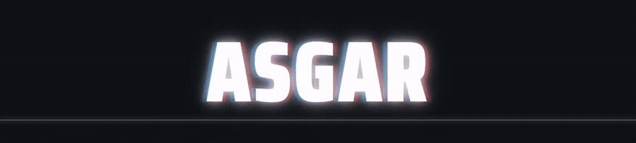

<div align="center">
  
</div>

<p align="center">
  <a href="https://git.io/typing-svg"></a>
</div>
  
  ---

## `whoami`

```bash
$ cat /etc/passwd | grep asgar
asgar:x:1337:1337:Threat Hunter, Detection Engineer:/home/asgar:/bin/bash
```

```yaml
name: Asgar, Tashnim 
handle: lanceterminal
coverage:
  - Enterprise Cyber Defense Architect
  - Digital Forensics Incident Response
  - Identity & Cloud Incident Response
  - Detection Engineering
```

---

## `./certifications`

<div align="center">

| Credential | Issuer | Verify |
|---|---|---|
| 🥇 GIAC Certified Incident Handler (GCIH) | GIAC / SANS | [Credly](https://www.credly.com/badges/d2d01ae1-297d-4b64-b0ea-e95d584e10ec/public_url) |
| 🔍 GIAC Certified Intrusion Analyst (GCIA) | GIAC / SANS | [Credly](https://www.credly.com/badges/9b3a8315-373d-468d-aa01-ed422e7876c4/public_url) |
| 🛡️ GIAC Security Essentials (GSEC) | GIAC / SANS | [Credly](https://www.credly.com/badges/14d02211-c91e-4906-8d90-ec7267ed47c9/public_url) |
| ✅ CompTIA Security+ | CompTIA | [Credly](https://www.credly.com/badges/1addd3a4-9491-4df3-a01f-728256447607/public_url) |

</div>

---

## `./achievements`

<div align="center">

| Achievement | Year |
|---|---|
| 🏆 SANS Core NetWars Tournament of Champions | 2025 |
| 🎖️ GIAC Advisory Board Member | Active |

</div>

---


---
[](mailto:connect@asgar.net)
[](https://substack.com/@lanceterminal)
[](https://github.com/lanceterminal/)
[](https://linkedin.com/in/asgartashnim)
[](https://x.com/lancetermina1)
[](https://asgar.net/)
